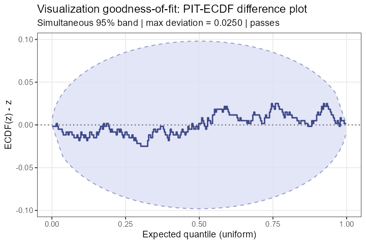
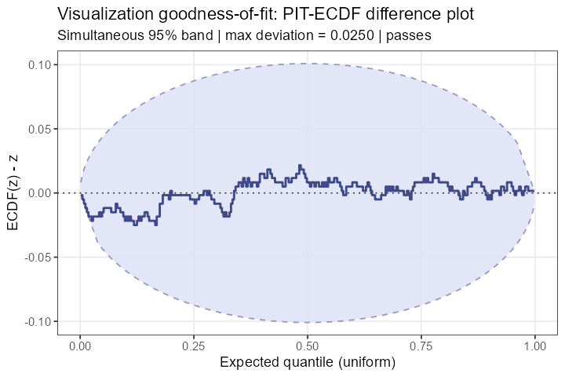
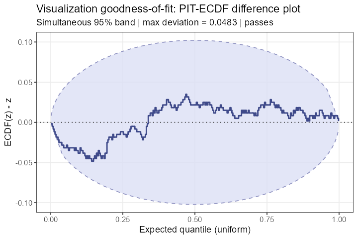
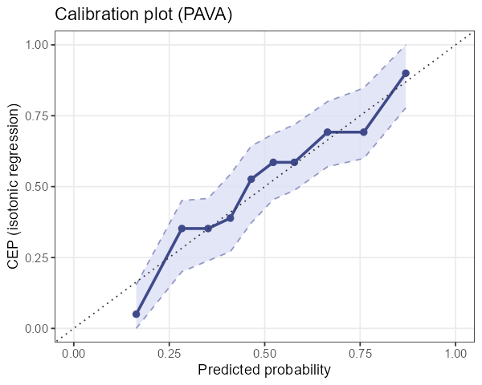
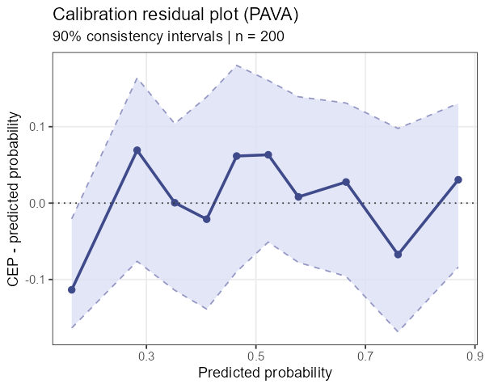
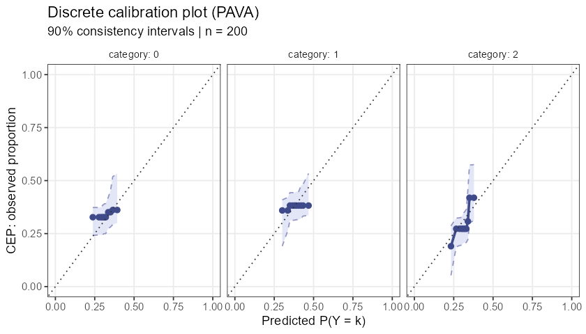

# ppcviz 

**Diagnostics and Recommendations for Visual Predictive Checks in Bayesian Workflow**

[](LICENSE.md)

---

An R package implementing the methodology from [Säilynoja, Johnson, Martin & Vehtari (2025)](https://arxiv.org/abs/2503.01509) to answer a question that **bayesplot** cannot:

> **Is the plot type I chose actually faithful to my data?**

A KDE overlay, a histogram, and a quantile dot plot all represent the same
data differently. `ppcviz` quantifies how much each representation distorts
the distribution using *visualization PIT values* as a diagnostic probe.

This is an independent reimplementation for self-learning purposes.
All statistical methodology belongs to the original paper authors.

## Key features

| Capability | Functions |
|---|---|
| **Visualization PIT values** — test if a plot type faithfully represents data | `pit_kde()`, `pit_histogram()`, `pit_qdotplot()` |
| **Goodness-of-fit test** — simultaneous ECDF band test for PIT uniformity | `viz_gof()`, `check_viz()` |
| **Data property detection** — detect discreteness, point masses, boundaries | `detect_discrete()`, `detect_bounds()` |
| **PAVA calibration plots** — calibration for binary and discrete outcomes | `ppc_calibration()`, `ppc_calibration_residual()`, `ppc_calibration_discrete()` |
| **Automatic recommender** — data-driven PPC plot selection | `recommend_ppc()` |

## Installation

```r
# From GitHub
devtools::install_github("utkarshpawade/ppcviz")

# Or from local source
devtools::install("path/to/ppcviz")
```

## Quick example

```r
library(ppcviz)
set.seed(42)

# Is a KDE plot appropriate for this data?
y <- rnorm(300)
check_viz(y, method = "kde")
#> KDE density plot is APPROPRIATE for this data.

# What about bounded Beta data without correction?
y_beta <- rbeta(300, 2, 5)
check_viz(y_beta, method = "kde")
#> KDE density plot may be MISLEADING for this data.

# Fix it with boundary correction
check_viz(y_beta, method = "kde", bounds = c(0, 1))
#> KDE density plot is APPROPRIATE for this data.

# Get an automatic recommendation for any data type
recommend_ppc(rpois(300, lambda = 3))
#> Data type: DISCRETE
#> RECOMMENDED: ppc_rootogram(), ppc_bars()
```

## Gallery

### Visualization goodness-of-fit

KDE on normal data **passes** | KDE on Beta(2,5) without bounds **fails** | With `bounds = c(0,1)` **passes**
:---:|:---:|:---:
 |  | 

### PAVA calibration plots (not available in bayesplot)

Binary calibration | Calibration residuals | Discrete / ordinal
:---:|:---:|:---:
 |  | 

## Learn more

- **[Get started](https://utkarshpawade.github.io/ppcviz/articles/ppcviz-intro.html)** — full walkthrough of all features with worked examples
- **[Function reference](https://utkarshpawade.github.io/ppcviz/reference/)** — detailed documentation for every exported function

## Source paper

> Säilynoja, T., Johnson, A., Martin, R., & Vehtari, A. (2025).
> [*Recommendations for visual predictive checks in Bayesian workflow*](https://arxiv.org/abs/2503.01509).
> arXiv:2503.01509.

Please cite the original paper, not this repository.
