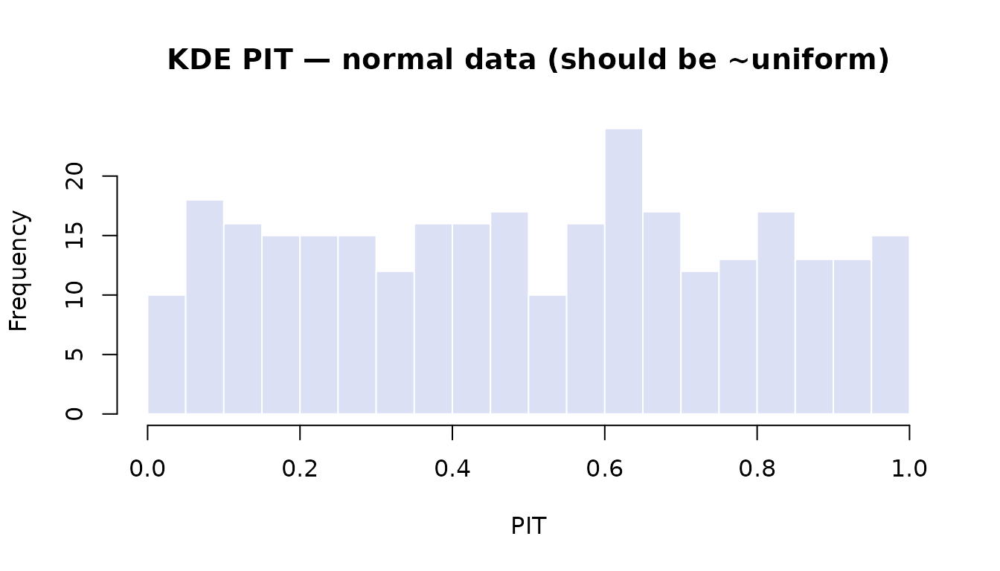
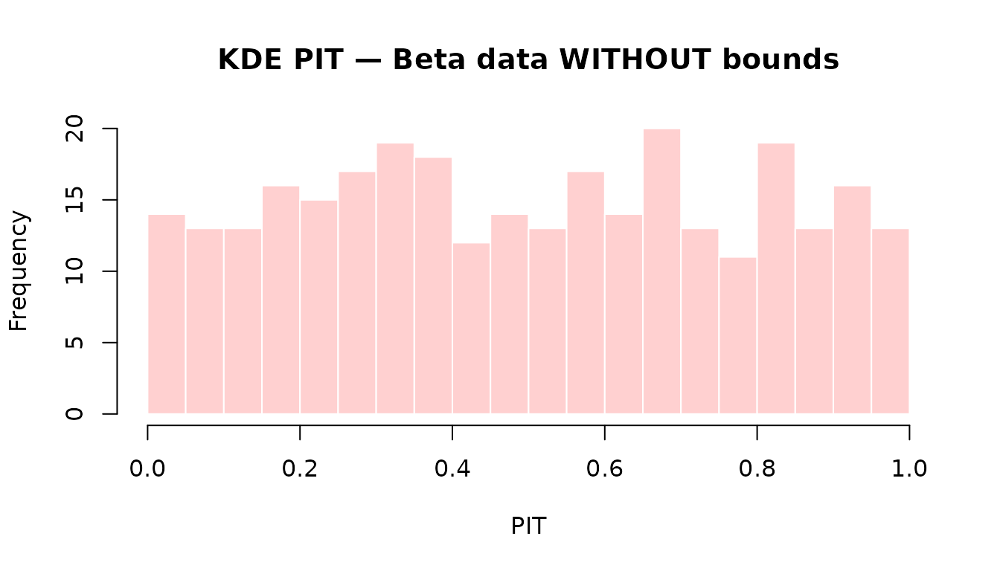
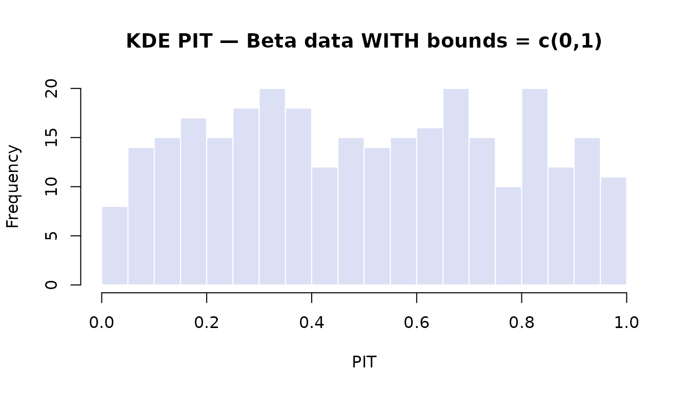
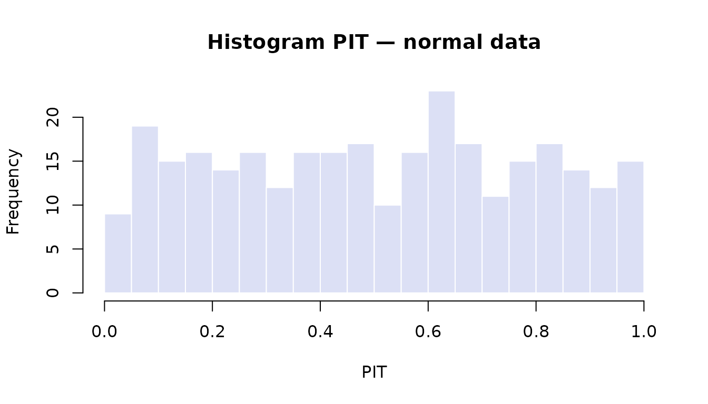
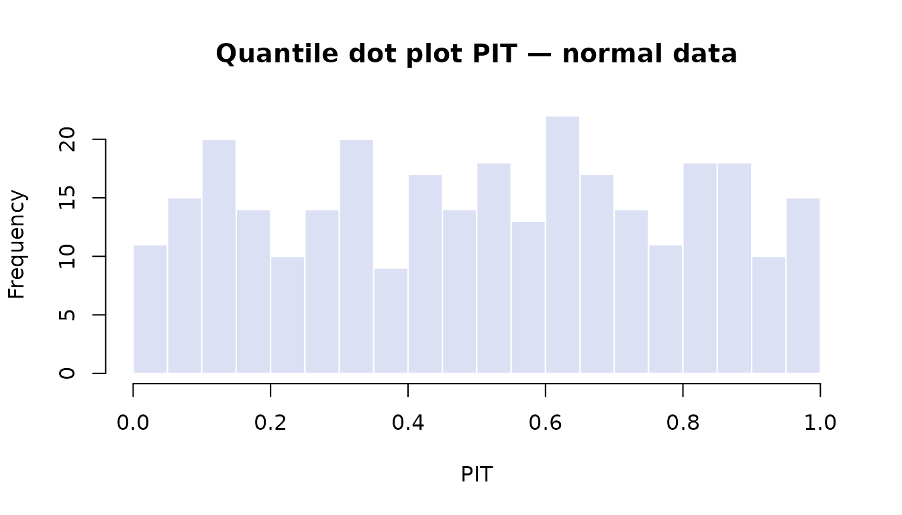
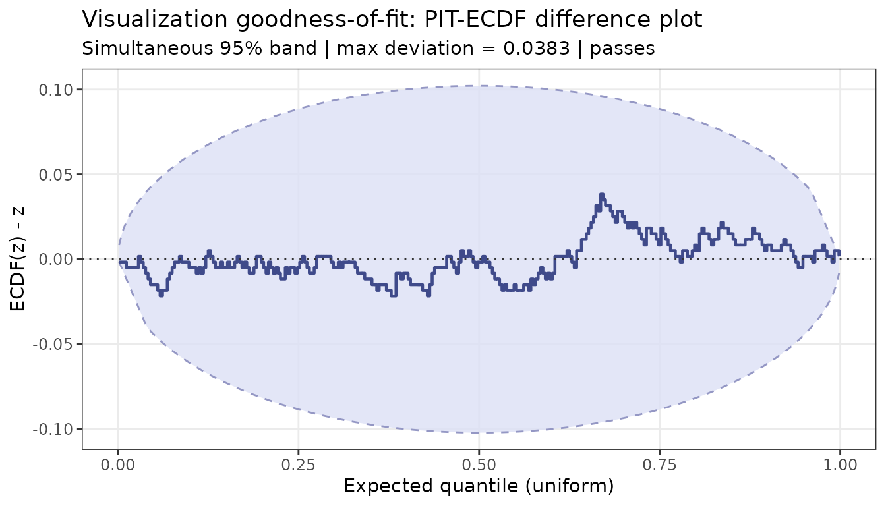
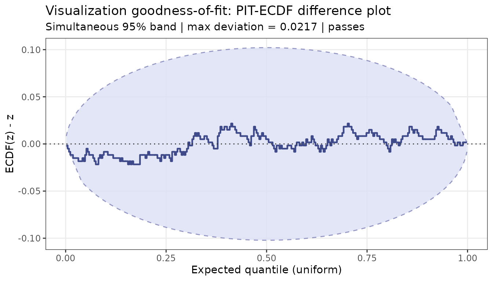
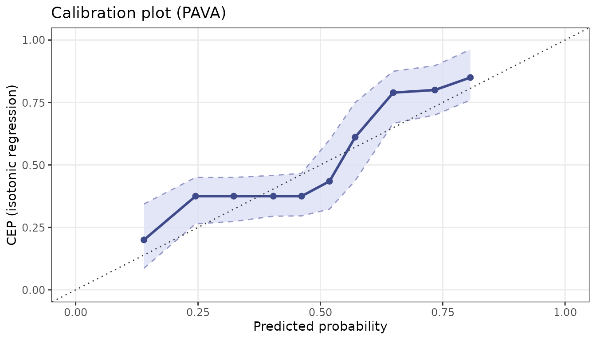
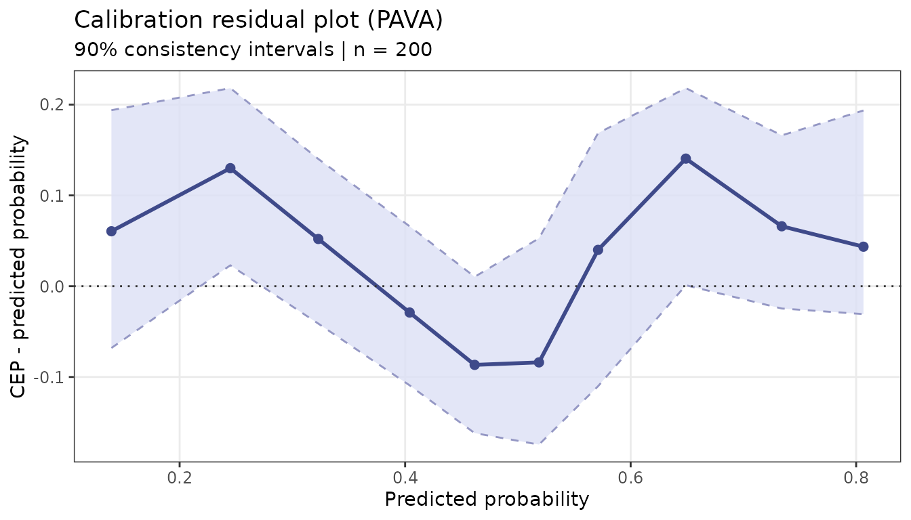
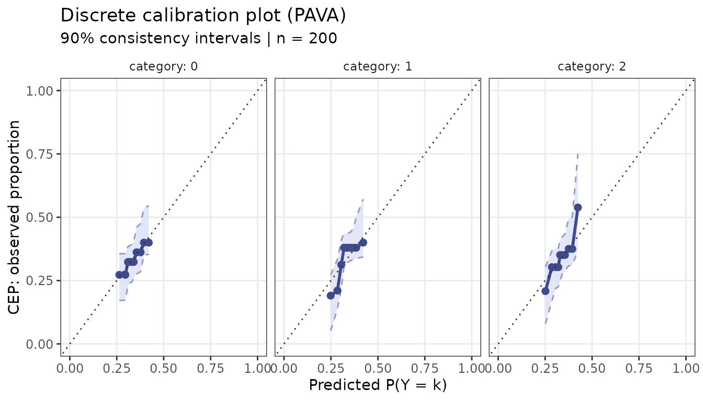

# Introduction to ppcviz

## Overview

`ppcviz` implements the novel diagnostic tools from:

> Säilynoja, T., Johnson, A., Martin, R., & Vehtari, A. (2025).
> *Recommendations for visual predictive checks in Bayesian workflow*.
> arXiv:2503.01509.

The core idea is: **treat the visualization itself as a density
estimator** and test whether it faithfully represents the data. A
beautiful plot that misrepresents the distribution is worse than no plot
at all.

``` r
library(ppcviz)
```

------------------------------------------------------------------------

### Part 1: Data Property Detection

Before choosing a plot, diagnose your data.

#### Discreteness detection

``` r
# Continuous normal — nothing flagged
detect_discrete(rnorm(300))
#> Discreteness / point-mass check
#> --------------------------------
#>   Observations : 300
#>   Unique values: 300 (ratio 1.000)
#>   Threshold    : 2.0%
#> 
#>   Result: No point masses detected. Data appears continuous.

# Poisson counts
detect_discrete(rpois(300, lambda = 4))
#> Discreteness / point-mass check
#> --------------------------------
#>   Observations : 300
#>   Unique values: 12 (ratio 0.040)
#>   Threshold    : 2.0%
#> 
#>   Result: DISCRETE data detected.
#>   Values with relative frequency > threshold:
#>     value = 1  (freq = 4.0%)
#>     value = 2  (freq = 15.7%)
#>     value = 3  (freq = 18.7%)
#>     value = 4  (freq = 21.7%)
#>     value = 5  (freq = 15.7%)
#>     value = 6  (freq = 9.7%)
#>     value = 7  (freq = 4.0%)
#>     value = 8  (freq = 6.0%)
#>   Recommendation: Use ppc_rootogram() or ppc_bars();
#>   avoid KDE-based plots.

# Zero-inflated normal
y_mixed <- c(rep(0, 80), rnorm(220, mean = 2))
detect_discrete(y_mixed)
#> Discreteness / point-mass check
#> --------------------------------
#>   Observations : 300
#>   Unique values: 221 (ratio 0.737)
#>   Threshold    : 2.0%
#> 
#>   Result: MIXED / ZERO-INFLATED data detected.
#>   Point masses with relative frequency > threshold:
#>     value = 0  (freq = 26.7%)
#>   Recommendation: Separate discrete/continuous components;
#>   consider ppc_rootogram() or a hurdle/mixture model check.
```

#### Boundary detection

``` r
# Unbounded
detect_bounds(rnorm(300))
#> Boundary detection check
#> ------------------------
#>   Data range: [-2.941, 2.385]
#> 
#>   Lower bound: none detected
#>   Upper bound: none detected
#> 
#>   Result: No natural boundaries detected. Data appears UNBOUNDED.
#>   Recommendation: Standard ppc_dens_overlay() should be appropriate.

# Non-negative
detect_bounds(rexp(300))
#> Boundary detection check
#> ------------------------
#>   Data range: [0.003238, 5.776]
#> 
#>   Lower bound: 0
#>   Upper bound: 5.776
#> 
#>   Result: Data appears NON-NEGATIVE (lower bound = 0).
#>   Recommendation: Use ppc_dens_overlay(bounds = c(0, Inf)) or
#>   ppc_ecdf_overlay().

# Proportions [0, 1]
detect_bounds(rbeta(300, 2, 5))
#> Boundary detection check
#> ------------------------
#>   Data range: [0.02019, 0.7697]
#> 
#>   Lower bound: 0
#>   Upper bound: 1
#> 
#>   Result: Data appears to be PROPORTIONS bounded to [0, 1].
#>   Recommendation: Use ppc_dens_overlay(bounds = c(0, 1)) or
#>   ppc_ecdf_overlay() to avoid boundary bias in KDE.
```

------------------------------------------------------------------------

### Part 2: Visualization PIT Values

The *visualization PIT* (Probability Integral Transform) quantifies how
well a chosen plot type represents the empirical distribution. If the
PIT values are uniform on $\lbrack 0,1\rbrack$, the visualization is
faithful; non-uniformity reveals where the plot is misleading.

#### KDE PIT

``` r
y <- rnorm(300)
pit <- pit_kde(y)
hist(pit, breaks = 25, main = "KDE PIT — normal data (should be ~uniform)",
     xlab = "PIT", col = "#DCE0F5", border = "white")
```



##### Bounded data

Without a boundary correction, a KDE on $\lbrack 0,1\rbrack$ data leaks
density outside the valid range, causing systematic non-uniformity:

``` r
y_beta <- rbeta(300, 2, 5)

# Without bounds — PIT will pile up near 0 and 1
pit_bad <- pit_kde(y_beta)
hist(pit_bad, breaks = 25, main = "KDE PIT — Beta data WITHOUT bounds",
     xlab = "PIT", col = "#FFD0D0", border = "white")
```



``` r

# With reflection correction — should be ~uniform
pit_ok <- pit_kde(y_beta, bounds = c(0, 1))
hist(pit_ok, breaks = 25, main = "KDE PIT — Beta data WITH bounds = c(0,1)",
     xlab = "PIT", col = "#DCE0F5", border = "white")
```



#### Histogram PIT

``` r
pit_h <- pit_histogram(y)
hist(pit_h, breaks = 25, main = "Histogram PIT — normal data",
     xlab = "PIT", col = "#DCE0F5", border = "white")
```



#### Quantile dot plot PIT

``` r
pit_q <- pit_qdotplot(y, n_quantiles = 50L)
hist(pit_q, breaks = 25, main = "Quantile dot plot PIT — normal data",
     xlab = "PIT", col = "#DCE0F5", border = "white")
```



------------------------------------------------------------------------

### Part 3: Goodness-of-Fit for Visualizations

[`viz_gof()`](https://utkarshpawade.github.io/ppcviz/reference/viz_gof.md)
tests whether the PIT values are consistent with uniformity using
*simultaneous* ECDF confidence bands (Säilynoja, Bürkner & Vehtari
2022).

``` r
# Normal data with KDE — should pass
result_pass <- viz_gof(pit_kde(y), n_sim = 500)
print(result_pass)
#> [OK] Visualization GoF test PASSES (prob = 95%, max deviation = 0.0383)
#>     The visualization appears faithful to the data distribution.
plot(result_pass)
```



``` r
# Beta data without boundary correction — may fail
result_fail <- viz_gof(pit_kde(y_beta), n_sim = 500)
print(result_fail)
#> [OK] Visualization GoF test PASSES (prob = 95%, max deviation = 0.0217)
#>     The visualization appears faithful to the data distribution.
plot(result_fail)
```



#### Convenience wrapper

[`check_viz()`](https://utkarshpawade.github.io/ppcviz/reference/check_viz.md)
combines PIT computation and the GoF test and prints a human-readable
verdict:

``` r
check_viz(y, method = "kde")
#> KDE density plot is APPROPRIATE for this data. (max ECDF deviation = 0.0383 is
#> within the 95% simultaneous band)
check_viz(y_beta, method = "kde")
#> KDE density plot is APPROPRIATE for this data. (max ECDF deviation = 0.0217 is
#> within the 95% simultaneous band)
check_viz(y_beta, method = "kde", bounds = c(0, 1))
#> KDE density plot is APPROPRIATE for this data. (max ECDF deviation = 0.0350 is
#> within the 95% simultaneous band)
```

------------------------------------------------------------------------

### Part 4: PAVA Calibration Plots

These plots are the paper’s main contribution for **binary and discrete
outcomes**. They do not exist in `bayesplot`.

#### Binary calibration

``` r
n <- 200
true_p <- plogis(rnorm(n))
y_bin  <- rbinom(n, 1, true_p)
yrep   <- do.call(rbind, lapply(seq_len(100), function(i) rbinom(n, 1, true_p)))

# Well-calibrated predictions — should be near the diagonal
ppc_calibration(y_bin, yrep, n_boot = 200)
```



``` r
ppc_calibration_residual(y_bin, yrep, n_boot = 200)
```



#### Discrete / ordinal calibration

``` r
y3    <- sample(0:2, n, replace = TRUE)
yrep3 <- do.call(rbind, lapply(seq_len(100), function(i) sample(0:2, n, replace = TRUE)))
ppc_calibration_discrete(y3, yrep3, n_boot = 100)
```



------------------------------------------------------------------------

### Part 5: Automatic Recommender

[`recommend_ppc()`](https://utkarshpawade.github.io/ppcviz/reference/recommend_ppc.md)
combines all the detection and testing logic to suggest the most
appropriate `bayesplot` (or `ppcviz`) function for your data:

``` r
recommend_ppc(rnorm(300))
#> PPC plot recommendation
#> =======================
#>   Data type: CONTINUOUS
#> 
#>   Reason:
#>     Data appears CONTINUOUS and UNBOUNDED. ppc_dens_overlay() is
#>     generally appropriate. Provide `yrep` to additionally test KDE
#>     faithfulness. 
#> 
#>   RECOMMENDED:
#>     + ppc_dens_overlay()
#>     + ppc_ecdf_overlay()
```

``` r
recommend_ppc(rexp(300))
#> PPC plot recommendation
#> =======================
#>   Data type: CONTINUOUS
#> 
#>   Reason:
#>     Data appears NON-NEGATIVE with a hard lower bound at 0. Use
#>     boundary-corrected KDE with bounds = c(0, Inf) to prevent
#>     density mass at negative values. 
#> 
#>   RECOMMENDED:
#>     + ppc_dens_overlay(bounds = c(0, Inf))
#>     + ppc_ecdf_overlay()
#> 
#>   AVOID:
#>     - ppc_dens_overlay()  # without bounds
```

``` r
recommend_ppc(rbeta(300, 2, 5))
#> PPC plot recommendation
#> =======================
#>   Data type: CONTINUOUS
#> 
#>   Reason:
#>     Data appears to be PROPORTIONS bounded to [0, 1]. Use
#>     boundary-corrected KDE with bounds = c(0, 1) to avoid density
#>     leakage outside the valid range. 
#> 
#>   RECOMMENDED:
#>     + ppc_dens_overlay(bounds = c(0, 1))
#>     + ppc_ecdf_overlay()
#> 
#>   AVOID:
#>     - ppc_dens_overlay()  # without bounds
```

``` r
recommend_ppc(rpois(300, lambda = 3))
#> PPC plot recommendation
#> =======================
#>   Data type: DISCRETE
#> 
#>   Reason:
#>     Data is DISCRETE with 11 unique values. KDE-based density plots
#>     will misrepresent the distribution. Use rootogram or bar plots
#>     for small discrete spaces, or ECDF-based plots for larger ones. 
#> 
#>   RECOMMENDED:
#>     + ppc_rootogram()
#>     + ppc_bars()
#> 
#>   AVOID:
#>     - ppc_dens_overlay()
#>     - ppc_dots()
```

``` r
recommend_ppc(c(rep(0, 70), rnorm(230, mean = 2)))
#> PPC plot recommendation
#> =======================
#>   Data type: MIXED
#> 
#>   Reason:
#>     Data appears MIXED / ZERO-INFLATED. Point masses were detected
#>     alongside a continuous bulk. Separate the discrete and
#>     continuous components, or use ppc_rootogram() for count-like
#>     data. 
#> 
#>   RECOMMENDED:
#>     + ppc_rootogram()
#>     + ppc_ecdf_overlay(discrete = TRUE)
#> 
#>   AVOID:
#>     - ppc_dens_overlay()
```

``` r
recommend_ppc(sample(0:1, 300, replace = TRUE))
#> PPC plot recommendation
#> =======================
#>   Data type: BINARY
#> 
#>   Reason:
#>     Data is BINARY (only 0 and 1). Use PAVA calibration plots to
#>     assess probability calibration. Density-based and ECDF plots
#>     are not appropriate for binary outcomes. 
#> 
#>   RECOMMENDED:
#>     + ppc_calibration()
#>     + ppc_calibration_residual()
#> 
#>   AVOID:
#>     - ppc_dens_overlay()
#>     - ppc_ecdf_overlay()
```

------------------------------------------------------------------------

### Citation

If you use `ppcviz` in a publication, please cite the original paper:

    Säilynoja, T., Johnson, A., Martin, R., & Vehtari, A. (2025).
    Recommendations for visual predictive checks in Bayesian workflow.
    arXiv:2503.01509.
